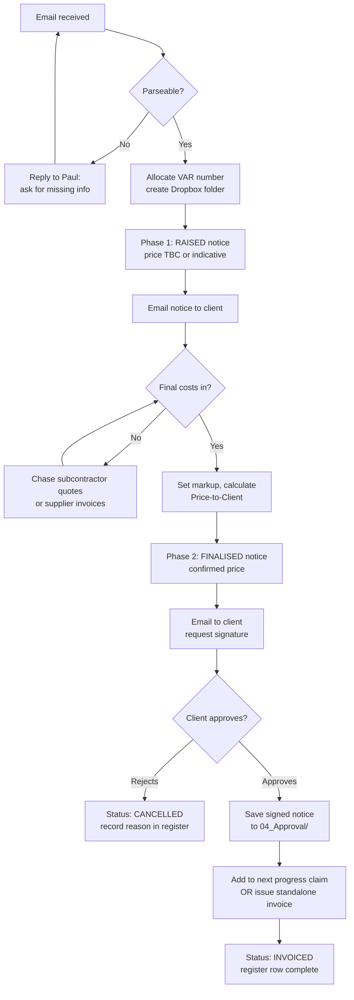

# Two-Phase Variation Workflow

Every variation passes through **two phases**:

1. **RAISED** — work has been identified, scope is known, price may be
   indicative or TBC. Issued promptly so the client is informed and the
   builder is not performing unwritten variations.
2. **FINALISED** — all costs are confirmed, the notice is reissued with the
   final price, and the client signs.

This split is required because in practice the trigger event (a site
condition, a client request, an architect change) often happens before
subcontractor quotes are returned. NSW law (HBA s.7AAA) requires the
variation to be **in writing** before it is performed — issuing a Phase 1
notice with "Price TBC, indicative $X" satisfies the spirit of that
requirement while protecting the builder from doing work for free.

## State machine

```
        ┌──────────┐
        │  INTAKE  │  email received, parsed, missing info chased up
        └────┬─────┘
             ↓
        ┌──────────┐
        │  RAISED  │  number allocated, folder created, Phase 1 notice issued
        └────┬─────┘
             │
       ┌─────┴─────┐
       ↓           ↓
  ┌─────────┐  ┌──────────┐
  │CANCELLED│  │  PRICED  │  all costs in, internal margin set
  └─────────┘  └────┬─────┘
                    ↓
              ┌──────────┐
              │FINALISED │  Phase 2 notice issued
              └────┬─────┘
                   ↓
              ┌──────────┐
              │ APPROVED │  client signed / written acceptance received
              └────┬─────┘
                   ↓
              ┌──────────┐
              │ INVOICED │  added to progress claim or invoiced standalone
              └──────────┘
```

Every state transition is logged in the master register (date + actor).

## Mermaid version (for GitHub render)



## Phase 1 — RAISED

**Trigger:** Email from Paul containing one or more of:
- a supplier invoice for unexpected work
- a client request ("can we also...")
- a site finding (rot, asbestos, undocumented service)
- an architect / engineer instruction

**Actions:**
1. Extract details using the email parsing checklist.
2. If price is missing, **ask Paul** before proceeding (see standard
   questions in `email_parsing_checklist.md`).
3. Allocate the next sequential variation number for the project.
4. Create the Dropbox folder under `03_Variations/`.
5. Save the original email and any attachments into `01_Source/`.
6. Add a new row to the project's `_Register/...xlsx`. Set Status = `RAISED`.
7. Generate the **Phase 1** Variation Notice:
   - Price section shows either an **indicative estimate** (with TBC
     marker) or a **fixed price** if already known.
   - Time impact is the operator's best estimate, marked `INDICATIVE` if not
     yet confirmed by the builder.
   - Status banner reads `PHASE 1 — RAISED (PRICE TO BE CONFIRMED)` or
     `PHASE 1 — RAISED (PRICE CONFIRMED, AWAITING ACKNOWLEDGMENT)`.
8. Save as `.docx` and `.pdf` in `03_Notice/`, filename
   `VAR-###_v1_RAISED.pdf`.
9. Email the PDF to the client. Save the sent email back to `05_Correspondence/`.

## Phase 2 — FINALISED

**Trigger:** All supplier invoices and quotes for the variation are in;
operator (or Paul) has set the markup.

**Actions:**
1. Update the register row:
   - Fill in all cost-to-me line items.
   - Set markup %.
   - Verify the Price-to-Client formula has populated correctly.
   - Set Status = `PRICED`.
2. Regenerate the notice as **Phase 2**:
   - Status banner: `PHASE 2 — FINALISED (FINAL PRICE)`.
   - Price section: ex-GST + GST + inc-GST line items.
   - Effect-on-contract-sum section shows updated running total.
3. Save as `VAR-###_v2_FINALISED.docx` / `.pdf` in `03_Notice/`.
4. Email to client, requesting:
   - signed acknowledgment (printed-and-signed, or "I accept" reply email).
5. Set Status = `FINALISED` once sent.
6. When acceptance returns, save into `04_Approval/`, set Status = `APPROVED`.
7. Pass to invoicing — flag on the next progress claim, or issue standalone
   invoice. Set Status = `INVOICED` when sent.

## Why two phases (not one)

- Issuing a notice quickly after the trigger event satisfies HBA s.7AAA
  ("variation must be in writing") even if pricing isn't finalised.
- It protects the builder: if the client later disputes the variation,
  there is dated written notice they were informed at the time.
- It protects the client: they aren't surprised by a large variation
  invoice at the end of the project.
- It keeps the register honest — RAISED variations show up in the project
  total even before their final price is known.

## What never moves between phases

- **Variation number** — stays the same across both phases.
- **Folder path** — same folder, new files.
- **Trigger date** — date the variation was first identified, not the date
  the price was finalised. Used to demonstrate prompt notice.
